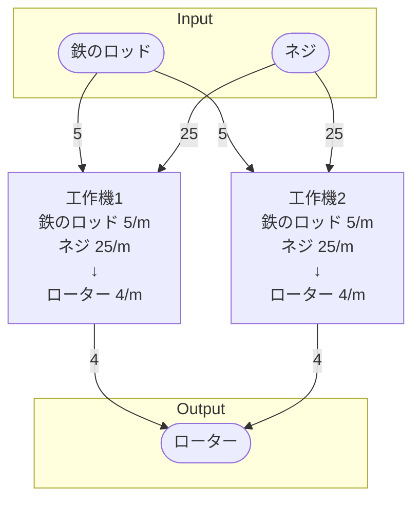

# 個別製造ライン設計書 ローター製造ライン

## 概要
鉄のロッドからローターを製造するライン

## Input
- 鉄のロッド 10/m
- ネジ 50/m

## Output
- ローター 8/m

## 必要設備
- 工作機 2ケ
- ベルトコンベア類 適量

## 製造ライン

```mermaid
flowchart TD

subgraph Input
    鉄のロッド([鉄のロッド])
    ネジ([ネジ])
end

工作機1[
    工作機1
    鉄のロッド 5/m
    ネジ 25/m
    ↓
    ローター 4/m
]

工作機2[
    工作機2
    鉄のロッド 5/m
    ネジ 25/m
    ↓
    ローター 4/m
]

subgraph Output
    ローター([ローター])
end

鉄のロッド-->|5|工作機1
ネジ-->|25|工作機1
工作機1-->|4|ローター
鉄のロッド-->|5|工作機2
ネジ-->|25|工作機2
工作機2-->|4|ローター
```

## 情報
書類テンプレートバージョン : 1.5.0
