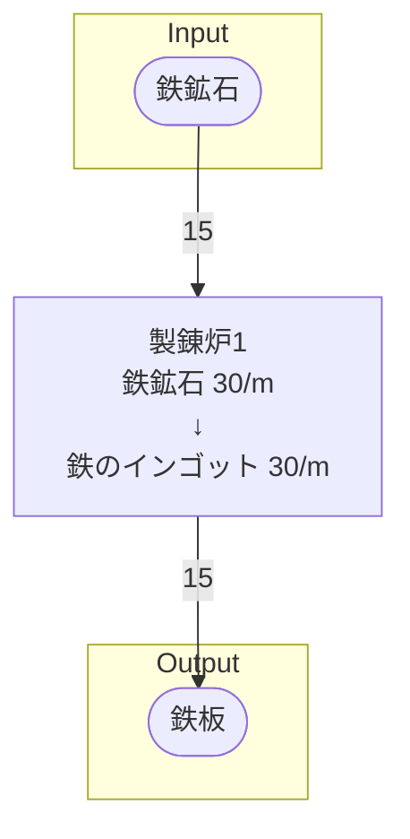

# 個別製造ライン設計書 鉄のインゴット 製造ライン

## 概要
初期一時工場の鉄鉱石から鉄のインゴットを製錬するライン

## Input
- 鉄鉱石 15/m

## Output
- 鉄インゴット 15/m
    - 鉄のロッドライン行き 15/m

## 必要設備
- 製錬炉 1
- ベルトコンベア類 適量

## 製造ライン

```mermaid
flowchart TD

subgraph Input
    鉄鉱石([鉄鉱石])
end

製錬炉1[
    製錬炉1
    鉄鉱石 30/m
    ↓
    鉄のインゴット 30/m
]

subgraph Output
    鉄板([鉄板])
end


鉄鉱石-->|15|製錬炉1
製錬炉1-->|15|鉄板


```

## 情報
書類バージョン : 1.3.0
