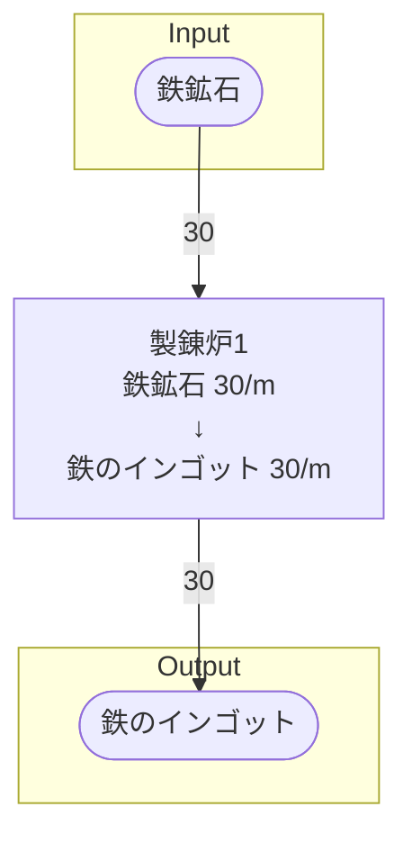

# 個別製造ライン設計書 鉄のインゴット製造ライン

## 概要
以下の物品を生産する

- 鉄のインゴット

## Input
- 鉄鉱石 30/m

## Output
- 鉄のインゴット 30/m

## 必要設備
- 製錬炉 1ケ
- ベルトコンベア類 適量

## 製造ライン

```mermaid
flowchart TD

subgraph Input
    鉄鉱石([鉄鉱石])
end

製錬炉1[
    製錬炉1
    鉄鉱石 30/m
    ↓
    鉄のインゴット 30/m
]

subgraph Output
    鉄のインゴット([鉄のインゴット])
end

鉄鉱石-->|30|製錬炉1
製錬炉1-->|30|鉄のインゴット
```

## 情報
書類テンプレートバージョン : 1.5.0
