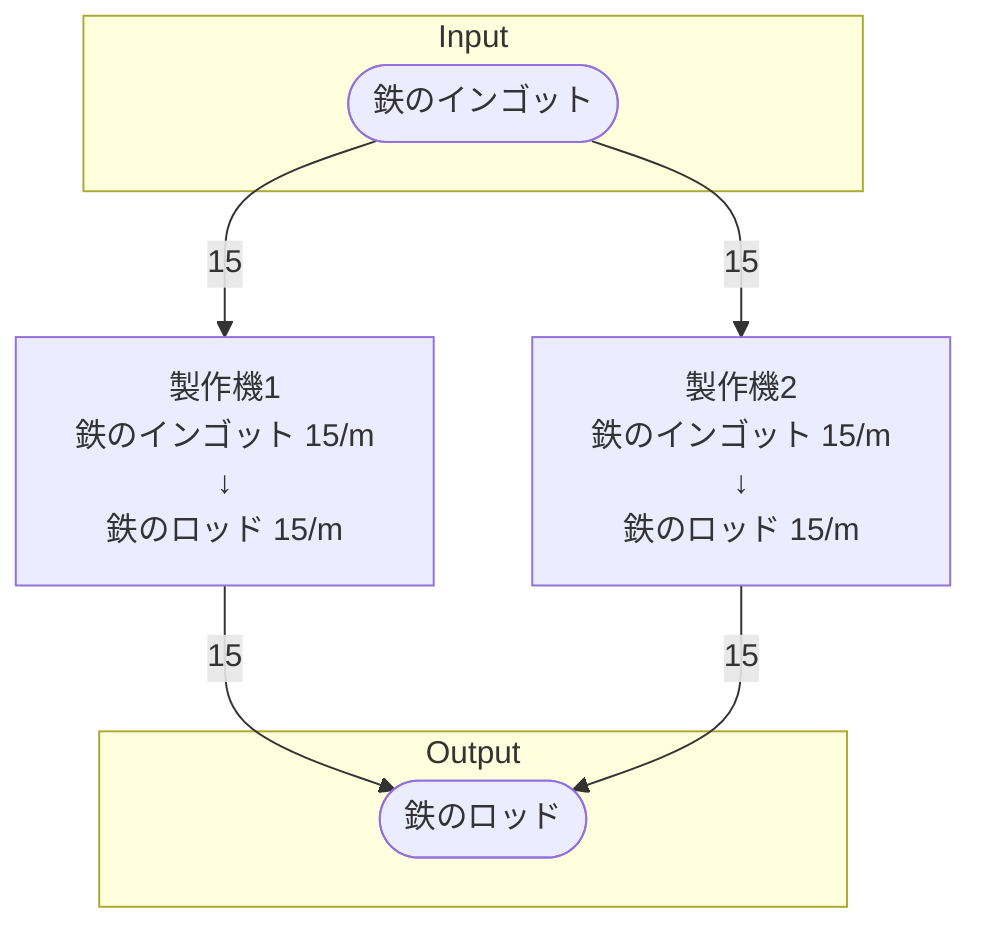

# 個別製造ライン設計書 鉄のロッド製造ライン

## 概要
以下の物品を生産する

- 鉄のロッド

## Input
- 鉄のインゴット 30/m

## Output
- 鉄のロッド 30/m

## 必要設備
- 製作機 2ケ
- ベルトコンベア類 適量

## 製造ライン

```mermaid
flowchart TD

subgraph Input
    鉄のインゴット([鉄のインゴット])
end

製作機1[
    製作機1
    鉄のインゴット 15/m
    ↓
    鉄のロッド 15/m
]

製作機2[
    製作機2
    鉄のインゴット 15/m
    ↓
    鉄のロッド 15/m
]

subgraph Output
    鉄のロッド([鉄のロッド])
end

鉄のインゴット-->|15|製作機1
製作機1-->|15|鉄のロッド
鉄のインゴット-->|15|製作機2
製作機2-->|15|鉄のロッド
```

## 情報
書類テンプレートバージョン : 1.5.0
