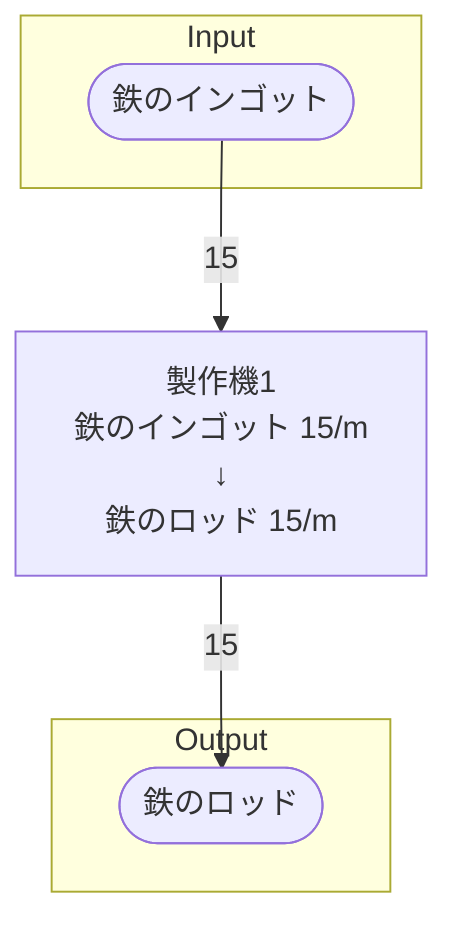

# 個別製造ライン設計書 鉄のロッド 製造ライン

## 概要
初期一時工場の鉄鉱石から鉄のロッドを製錬するライン

## Input
- 鉄のインゴット 15/m

## Output
- 鉄のロッド 15/m

## 必要設備
- 製作機 1
- ベルトコンベア類 適量

## 製造ライン

```mermaid
flowchart TD

subgraph Input
    鉄のインゴット([鉄のインゴット])
end

製作機1[
    製作機1
    鉄のインゴット 15/m
    ↓
    鉄のロッド 15/m
]

subgraph Output
    鉄のロッド([鉄のロッド])
end


鉄のインゴット-->|15|製作機1
製作機1-->|15|鉄のロッド


```

## 情報
書類テンプレートバージョン : 1.5.0
