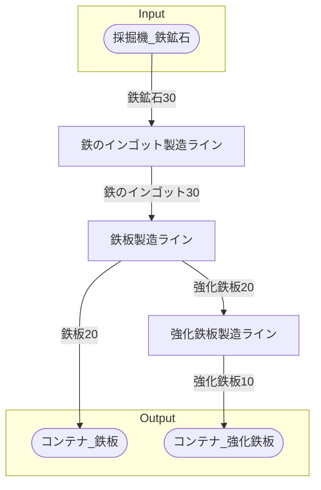

# 初期一時鉄板工場 全体製造ライン設計書

## 使用レシピ

### 鉄のインゴット
|I/O|物品名|要求数|
|---|---|---|
|input|鉄鉱石|30|
|---|---|---|
|output|鉄のインゴット|30|
### 鉄板
|I/O|物品名|要求数|
|---|---|---|
|input|鉄のインゴット|30|
|---|---|---|
|output|鉄板|20|
### 強化鉄板
|I/O|物品名|要求数|
|---|---|---|
|input|鉄板|30|
|input|ネジ|60|
|---|---|---|
|output|強化鉄板|5|

## 必要製造ライン
### 鉄のインゴット製造ライン

レシピ名 : 鉄のインゴット  
レシピ数 : 2

|I/O|物品名|要求数|
|---|---|---|
|input|鉄鉱石|60|
|---|---|---|
|output|鉄のインゴット|60|

### 鉄板製造ライン

レシピ名 : 鉄板  
レシピ数 : 2

|I/O|物品名|要求数|
|---|---|---|
|input|鉄のインゴット|60|
|---|---|---|
|output|鉄板|40|

### 強化鉄板製造ライン

レシピ名 : 強化鉄板  
レシピ数 : 2

|I/O|物品名|要求数|
|---|---|---|
|input|鉄板|60|
|input|ネジ|120|
|---|---|---|
|output|強化鉄板|10|

## 製造ラインフローチャート

## 情報
書類テンプレートバージョン : 1.7.0
