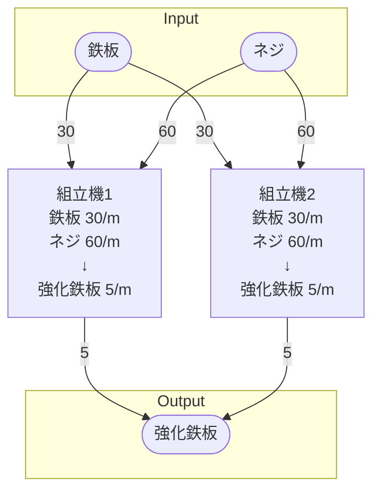

# 個別製造ライン設計書 強化鉄板製造ライン

## 概要
以下の物品を生産する

- 強化鉄板

## Input
- 鉄板 60/m
- ネジ 120/m

## Output
- 強化鉄板 10/m

## 必要設備
- 組立機 2ケ
- ベルトコンベア類 適量

## 製造ライン

```mermaid
flowchart TD

subgraph Input
    鉄板([鉄板])
    ネジ([ネジ])
end

組立機1[
    組立機1
    鉄板 30/m
    ネジ 60/m
    ↓
    強化鉄板 5/m
]

組立機2[
    組立機2
    鉄板 30/m
    ネジ 60/m
    ↓
    強化鉄板 5/m
]

subgraph Output
    強化鉄板([強化鉄板])
end

鉄板-->|30|組立機1
ネジ-->|60|組立機1
組立機1-->|5|強化鉄板
鉄板-->|30|組立機2
ネジ-->|60|組立機2
組立機2-->|5|強化鉄板
```

## 情報
書類テンプレートバージョン : 1.5.0
