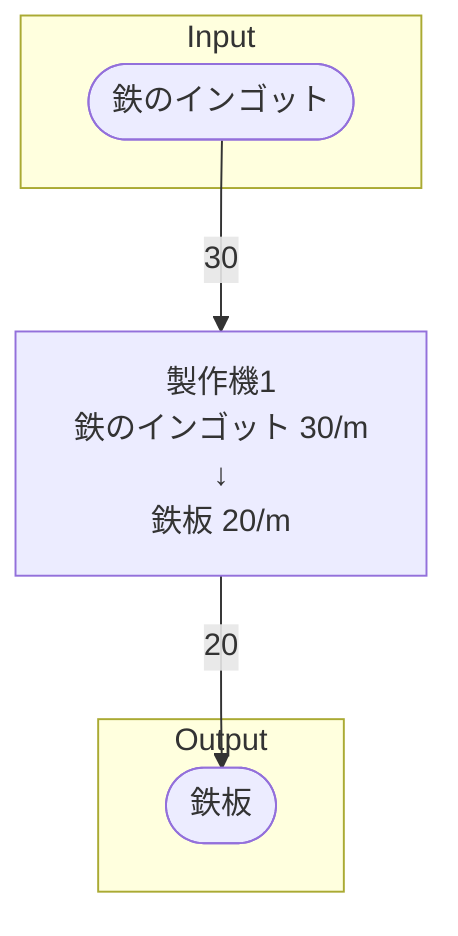

# 概要設計 鉄インゴット製造ライン

## 概要
初期一時工場の鉄のインゴットから鉄板を製錬するライン

## Input
- 鉄のインゴット 30/m

## Output
- 鉄板 20/m

## 必要設備
- 製作機 1
- ベルトコンベア類 適量

## 製造ライン

```mermaid
flowchart TD

subgraph Input
    鉄のインゴット([鉄のインゴット])
end

製作機1[
    製作機1
    鉄のインゴット 30/m
    ↓
    鉄板 20/m
]

subgraph Output
    鉄板([鉄板])
end


鉄のインゴット-->|30|製作機1
製作機1-->|20|鉄板


```
