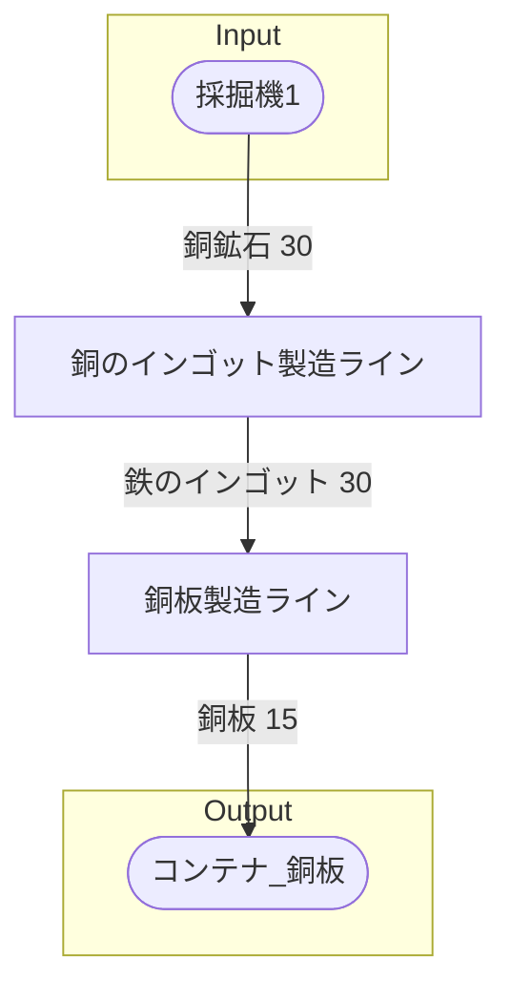

# 初期一時銅板工場 全体製造ライン設計書

## 使用レシピ
### 銅のインゴット
|Input|Output|
|---|---|
|銅鉱石 30/m|銅のインゴット 30/m|
### 銅板
|Input|Output|
|---|---|
|銅のインゴット 30/m|銅板 15/m|

## 必要製造ライン
### 銅のインゴット製造ライン
|レシピ名|数|Input計|Output計|
|---|---|---|---|
|銅のインゴット|1|銅鉱石 30/m|銅のインゴット 30/m|
### 銅板製造ライン
|レシピ名|数|Input計|Output計|
|---|---|---|---|
|銅板|1|銅のインゴット 30/m|銅板 20/m|

## 製造ラインフローチャート

## 情報
書類テンプレートバージョン : 1.7.0
