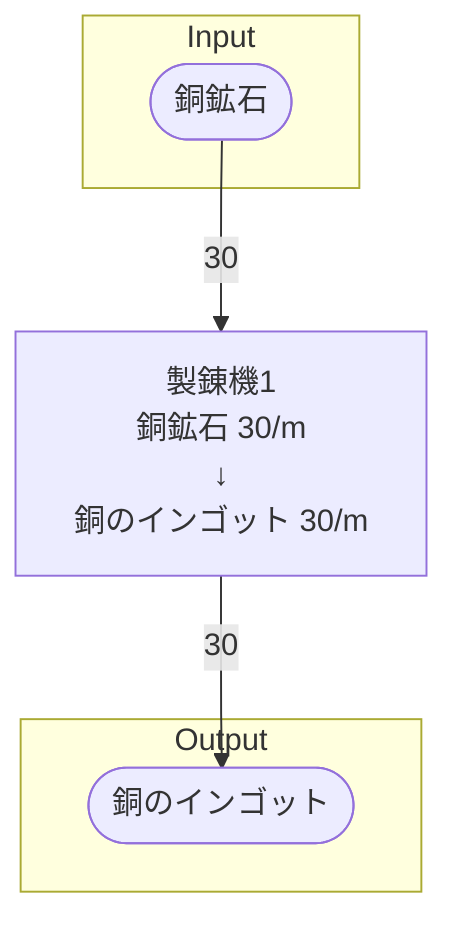

# 個別製造ライン設計書 銅のインゴット製造ライン

## 概要
銅鉱石から銅のインゴットを製造するライン

## Input
- 銅鉱石 30/m

## Output
- 銅のインゴット 30/m

## 必要設備
- 製錬機 1ケ
- ベルトコンベア類 適量

## 製造ライン

```mermaid
flowchart TD

subgraph Input
    銅鉱石([銅鉱石])
end

製錬機1[
    製錬機1
    銅鉱石 30/m
    ↓
    銅のインゴット 30/m
]

subgraph Output
    銅のインゴット([銅のインゴット])
end

銅鉱石-->|30|製錬機1
製錬機1-->|30|銅のインゴット
```

## 情報
書類テンプレートバージョン : 1.5.0
