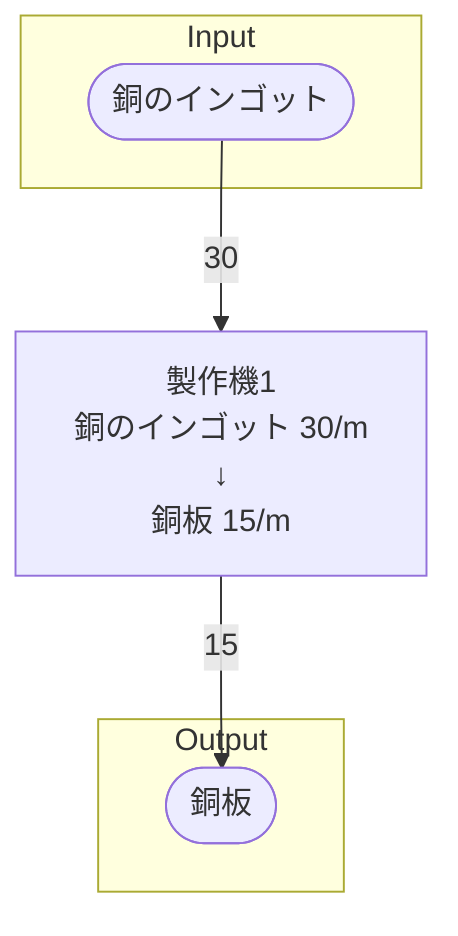

# 個別製造ライン設計書 銅板製造ライン

## 概要
以下の物品を生産する

- 銅板

## Input
- 銅のインゴット 30/m

## Output
- 銅板 15/m

## 必要設備
- 製作機 1ケ
- ベルトコンベア類 適量

## 製造ライン

```mermaid
flowchart TD

subgraph Input
    銅のインゴット([銅のインゴット])
end

製作機1[
    製作機1
    銅のインゴット 30/m
    ↓
    銅板 15/m
]

subgraph Output
    銅板([銅板])
end

銅のインゴット-->|30|製作機1
製作機1-->|15|銅板
```

## 情報
書類テンプレートバージョン : 1.5.0
