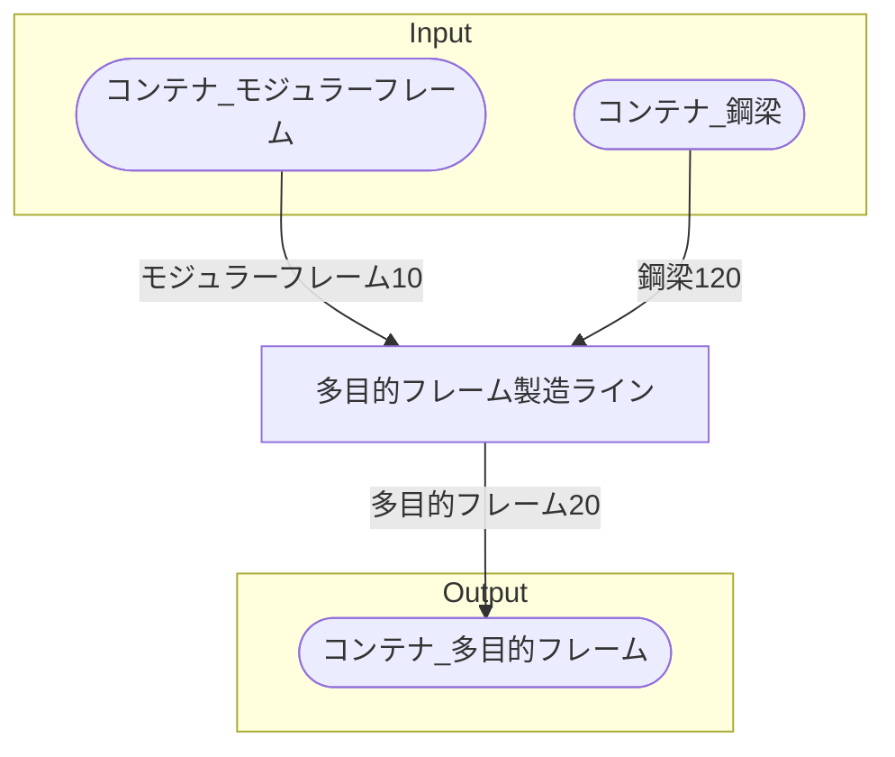

# 多目的フレーム工場 全体製造ライン設計書

## 使用レシピ

### 多目的フレーム
|I/O|物品名|要求数|
|---|---|---|
|input|モジュラーフレーム|2.5|
|input|鋼梁|30|
|---|---|---|
|output|多目的フレーム|5|

## 必要製造ライン
### 多目的フレーム製造ライン

レシピ名 : 多目的フレーム  
レシピ数 : 4

|I/O|物品名|要求数|
|---|---|---|
|input|モジュラーフレーム|10.0|
|input|鋼梁|120|
|---|---|---|
|output|多目的フレーム|20|

## 製造ラインフローチャート

## 情報
書類テンプレートバージョン : 1.7.0
