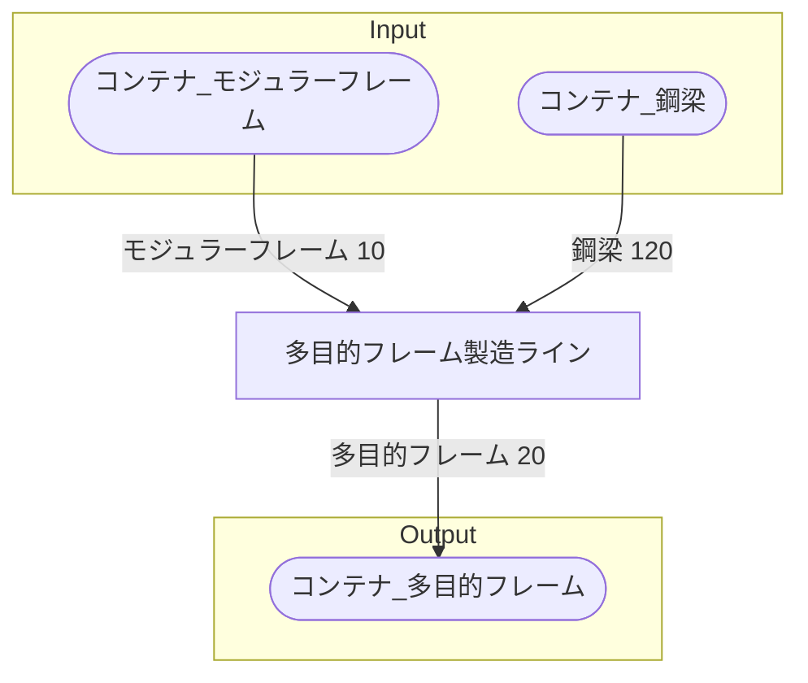

# 多目的フレーム工場 全体製造ライン設計書

## 使用レシピ
### 多目的フレーム
|Input|Output|
|---|---|
|モジュラーフレーム 2.5m|多目的フレーム 5/m|
|鋼梁 30/m||

## 必要製造ライン
### 多目的フレーム製造ライン
|レシピ名|数|Input計|Output計|
|---|---|---|---|
|多目的フレーム|4|モジュラーフレーム 10/m|鉄のインゴット 120/m|

## 製造ラインフローチャート

## 情報
書類テンプレートバージョン : 1.7.0
