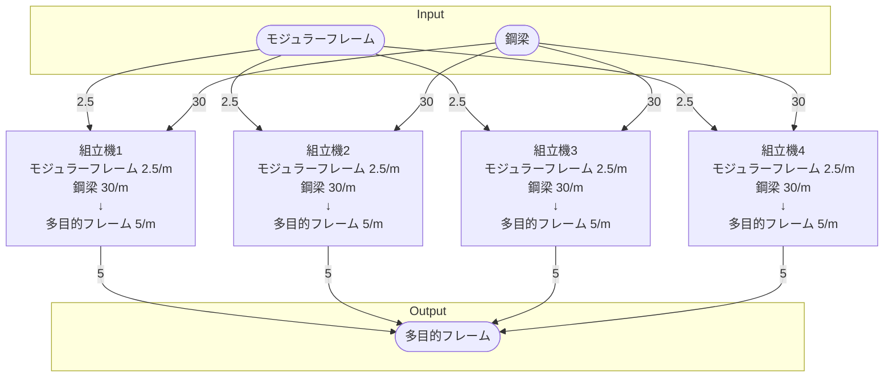

# 個別製造ライン設計書 多目的フレーム製造ライン

## 概要
多目的フレームを製造するライン

## Input
- モジュラーフレーム 10.0/m
- 鋼梁 120/m

## Output
- 多目的フレーム 20/m

## 必要設備
- 組立機 4ケ
- ベルトコンベア類 適量

## 製造ライン

```mermaid
flowchart TD

subgraph Input
    モジュラーフレーム([モジュラーフレーム])
    鋼梁([鋼梁])
end

組立機1[
    組立機1
    モジュラーフレーム 2.5/m
    鋼梁 30/m
    ↓
    多目的フレーム 5/m
]

組立機2[
    組立機2
    モジュラーフレーム 2.5/m
    鋼梁 30/m
    ↓
    多目的フレーム 5/m
]

組立機3[
    組立機3
    モジュラーフレーム 2.5/m
    鋼梁 30/m
    ↓
    多目的フレーム 5/m
]

組立機4[
    組立機4
    モジュラーフレーム 2.5/m
    鋼梁 30/m
    ↓
    多目的フレーム 5/m
]

subgraph Output
    多目的フレーム([多目的フレーム])
end

モジュラーフレーム-->|2.5|組立機1
鋼梁-->|30|組立機1
組立機1-->|5|多目的フレーム
モジュラーフレーム-->|2.5|組立機2
鋼梁-->|30|組立機2
組立機2-->|5|多目的フレーム
モジュラーフレーム-->|2.5|組立機3
鋼梁-->|30|組立機3
組立機3-->|5|多目的フレーム
モジュラーフレーム-->|2.5|組立機4
鋼梁-->|30|組立機4
組立機4-->|5|多目的フレーム
```

## 情報
書類テンプレートバージョン : 1.5.0
