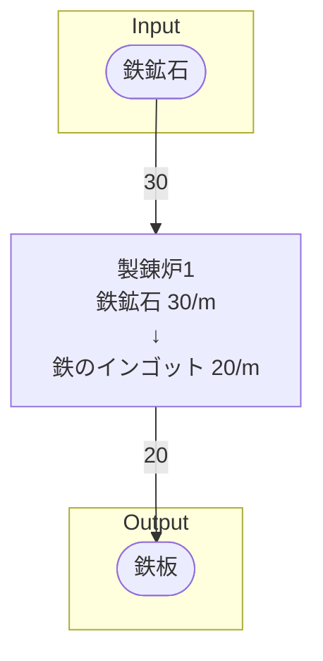

# 詳細設計 (製造ライン名)製造ライン

## 概要
製造ラインの概要

### 例
初期一時工場の鉄鉱石から鉄のインゴットを製錬するライン

## Input
搬入するアイテムと、その1分あたりの量

### 例
- 鉄鉱石 30/m

## Output
搬出するアイテムと、その1分あたりの量  
なお、どの製造ラインへ搬出するかを明記すること

### 例
- 鉄インゴット 30/m
    - 鉄板ライン行き 30/m

## 必要設備
製造ラインの建設に必要な設備を、個数と共に明記する

### 例
- 製錬炉 1
- ベルトコンベア類 適量

## 製造ライン

