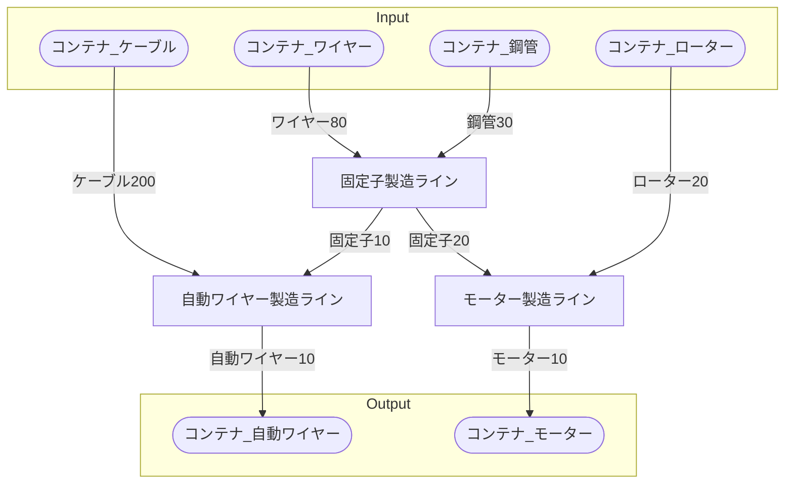

# 自動ワイヤー工場 全体製造ライン設計書

## 使用レシピ

### 自動ワイヤー
|I/O|物品名|要求数|
|---|---|---|
|input|固定子|2.5|
|input|ケーブル|50|
|---|---|---|
|output|自動ワイヤー|2.5|
### 固定子
|I/O|物品名|要求数|
|---|---|---|
|input|鋼管|15|
|input|ワイヤー|40|
|---|---|---|
|output|固定子|5|
### モーター
|I/O|物品名|要求数|
|---|---|---|
|input|固定子|10|
|input|ローター|10|
|---|---|---|
|output|モーター|5|

## 必要製造ライン
### 自動ワイヤー製造ライン

レシピ名 : 自動ワイヤー  
レシピ数 : 4

|I/O|物品名|要求数|
|---|---|---|
|input|固定子|10.0|
|input|ケーブル|200|
|---|---|---|
|output|自動ワイヤー|10.0|

### 固定子製造ライン

レシピ名 : 固定子  
レシピ数 : 4

|I/O|物品名|要求数|
|---|---|---|
|input|鋼管|60|
|input|ワイヤー|160|
|---|---|---|
|output|固定子|20|

### モーター製造ライン

レシピ名 : モーター  
レシピ数 : 2

|I/O|物品名|要求数|
|---|---|---|
|input|固定子|20|
|input|ローター|20|
|---|---|---|
|output|モーター|10|

## 製造ラインフローチャート

## 情報
書類テンプレートバージョン : 1.7.0
