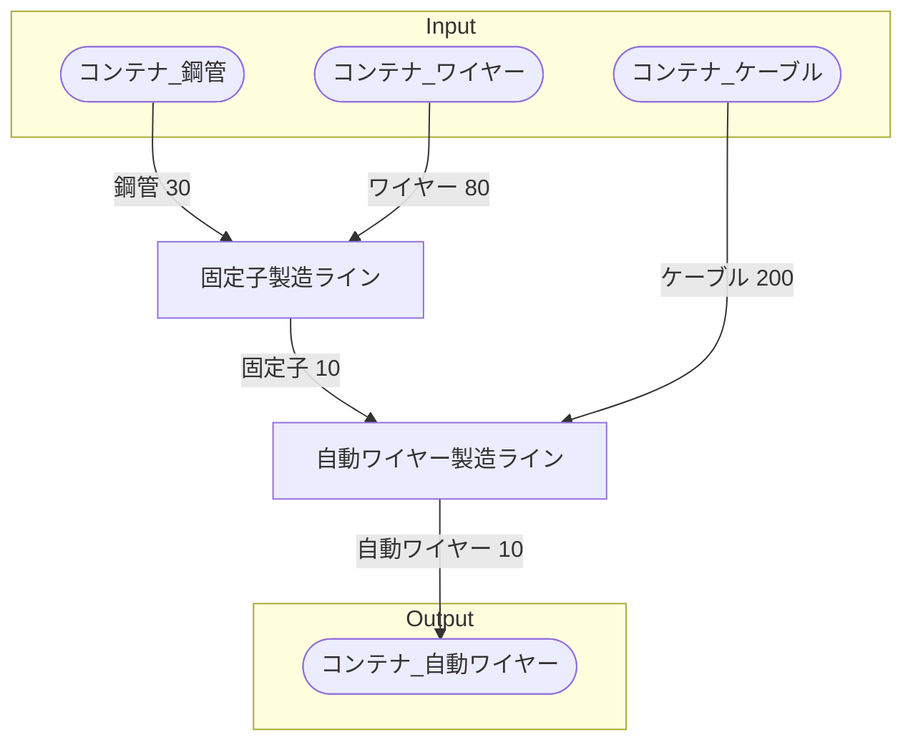

# 自動ワイヤー工場 全体製造ライン設計書

## 使用レシピ
### 自動ワイヤー
|Input|Output|
|---|---|
|固定子 2.5/m|自動ワイヤー 2.5/m|
|ケーブル 50/m||
### 固定子
|Input|Output|
|---|---|
|ワイヤー 40/m|固定子 5/m|
|鋼管 15/m||

## 必要製造ライン
### 自動ワイヤー製造ライン
|レシピ名|数|Input計|Output計|
|---|---|---|---|
|自動ワイヤー|4|固定子 10/m|自動ワイヤー 10/m|
|||ケーブル 200/m||
### 固定子製造ライン
|レシピ名|数|Input計|Output計|
|---|---|---|---|
|固定子|2|鋼管 30/m|固定子 10/m|
|||ワイヤー 80/m||

## 製造ラインフローチャート

## 情報
書類テンプレートバージョン : 1.7.0
