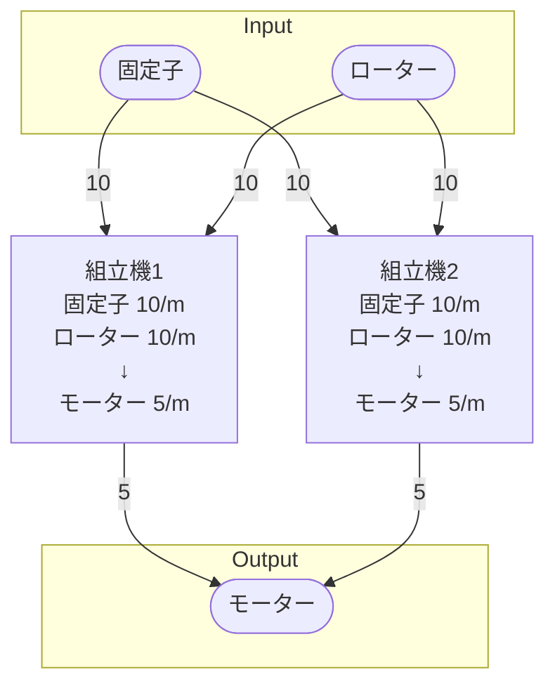

# 個別製造ライン設計書 モーター製造ライン

## 概要
以下の物品を生産する

- モーター

## Input
- 固定子 20/m
- ローター 20/m

## Output
- モーター 10/m

## 必要設備
- 組立機 2ケ
- ベルトコンベア類 適量

## 製造ライン

```mermaid
flowchart TD

subgraph Input
    固定子([固定子])
    ローター([ローター])
end

組立機1[
    組立機1
    固定子 10/m
    ローター 10/m
    ↓
    モーター 5/m
]

組立機2[
    組立機2
    固定子 10/m
    ローター 10/m
    ↓
    モーター 5/m
]

subgraph Output
    モーター([モーター])
end

固定子-->|10|組立機1
ローター-->|10|組立機1
組立機1-->|5|モーター
固定子-->|10|組立機2
ローター-->|10|組立機2
組立機2-->|5|モーター
```

## 情報
書類テンプレートバージョン : 1.5.0
