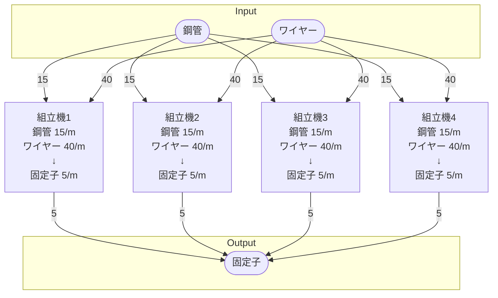

# 個別製造ライン設計書 固定子製造ライン

## 概要
以下の物品を生産する

- 固定子

## Input
- 鋼管 60/m
- ワイヤー 160/m

## Output
- 固定子 20/m

## 必要設備
- 組立機 4ケ
- ベルトコンベア類 適量

## 製造ライン

```mermaid
flowchart TD

subgraph Input
    鋼管([鋼管])
    ワイヤー([ワイヤー])
end

組立機1[
    組立機1
    鋼管 15/m
    ワイヤー 40/m
    ↓
    固定子 5/m
]

組立機2[
    組立機2
    鋼管 15/m
    ワイヤー 40/m
    ↓
    固定子 5/m
]

組立機3[
    組立機3
    鋼管 15/m
    ワイヤー 40/m
    ↓
    固定子 5/m
]

組立機4[
    組立機4
    鋼管 15/m
    ワイヤー 40/m
    ↓
    固定子 5/m
]

subgraph Output
    固定子([固定子])
end

鋼管-->|15|組立機1
ワイヤー-->|40|組立機1
組立機1-->|5|固定子
鋼管-->|15|組立機2
ワイヤー-->|40|組立機2
組立機2-->|5|固定子
鋼管-->|15|組立機3
ワイヤー-->|40|組立機3
組立機3-->|5|固定子
鋼管-->|15|組立機4
ワイヤー-->|40|組立機4
組立機4-->|5|固定子
```

## 情報
書類テンプレートバージョン : 1.5.0
