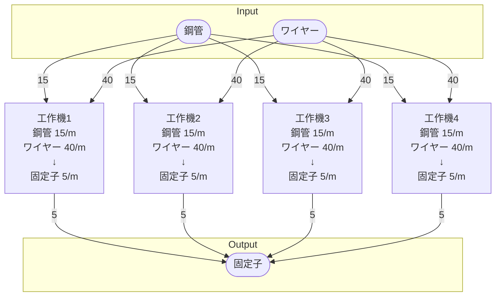

# 個別製造ライン設計書 固定子製造ライン

## 概要
固定子を製造するライン

## Input
- 鋼管 60/m
- ワイヤー 160/m

## Output
- 固定子 20/m

## 必要設備
- 工作機 4ケ
- ベルトコンベア類 適量

## 製造ライン

```mermaid
flowchart TD

subgraph Input
    鋼管([鋼管])
    ワイヤー([ワイヤー])
end

工作機1[
    工作機1
    鋼管 15/m
    ワイヤー 40/m
    ↓
    固定子 5/m
]

工作機2[
    工作機2
    鋼管 15/m
    ワイヤー 40/m
    ↓
    固定子 5/m
]

工作機3[
    工作機3
    鋼管 15/m
    ワイヤー 40/m
    ↓
    固定子 5/m
]

工作機4[
    工作機4
    鋼管 15/m
    ワイヤー 40/m
    ↓
    固定子 5/m
]

subgraph Output
    固定子([固定子])
end

鋼管-->|15|工作機1
ワイヤー-->|40|工作機1
工作機1-->|5|固定子
鋼管-->|15|工作機2
ワイヤー-->|40|工作機2
工作機2-->|5|固定子
鋼管-->|15|工作機3
ワイヤー-->|40|工作機3
工作機3-->|5|固定子
鋼管-->|15|工作機4
ワイヤー-->|40|工作機4
工作機4-->|5|固定子
```

## 情報
書類テンプレートバージョン : 1.5.0
