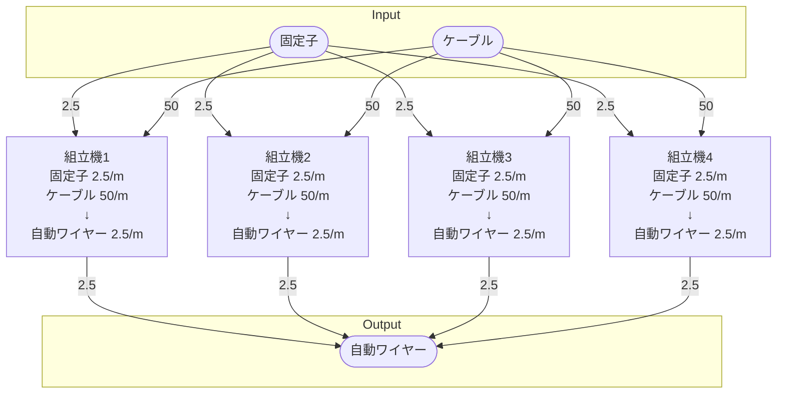

# 個別製造ライン設計書 自動ワイヤー製造ライン

## 概要
以下の物品を生産する

- 自動ワイヤー

## Input
- 固定子 10.0/m
- ケーブル 200/m

## Output
- 自動ワイヤー 10.0/m

## 必要設備
- 組立機 4ケ
- ベルトコンベア類 適量

## 製造ライン

```mermaid
flowchart TD

subgraph Input
    固定子([固定子])
    ケーブル([ケーブル])
end

組立機1[
    組立機1
    固定子 2.5/m
    ケーブル 50/m
    ↓
    自動ワイヤー 2.5/m
]

組立機2[
    組立機2
    固定子 2.5/m
    ケーブル 50/m
    ↓
    自動ワイヤー 2.5/m
]

組立機3[
    組立機3
    固定子 2.5/m
    ケーブル 50/m
    ↓
    自動ワイヤー 2.5/m
]

組立機4[
    組立機4
    固定子 2.5/m
    ケーブル 50/m
    ↓
    自動ワイヤー 2.5/m
]

subgraph Output
    自動ワイヤー([自動ワイヤー])
end

固定子-->|2.5|組立機1
ケーブル-->|50|組立機1
組立機1-->|2.5|自動ワイヤー
固定子-->|2.5|組立機2
ケーブル-->|50|組立機2
組立機2-->|2.5|自動ワイヤー
固定子-->|2.5|組立機3
ケーブル-->|50|組立機3
組立機3-->|2.5|自動ワイヤー
固定子-->|2.5|組立機4
ケーブル-->|50|組立機4
組立機4-->|2.5|自動ワイヤー
```

## 情報
書類テンプレートバージョン : 1.5.0
