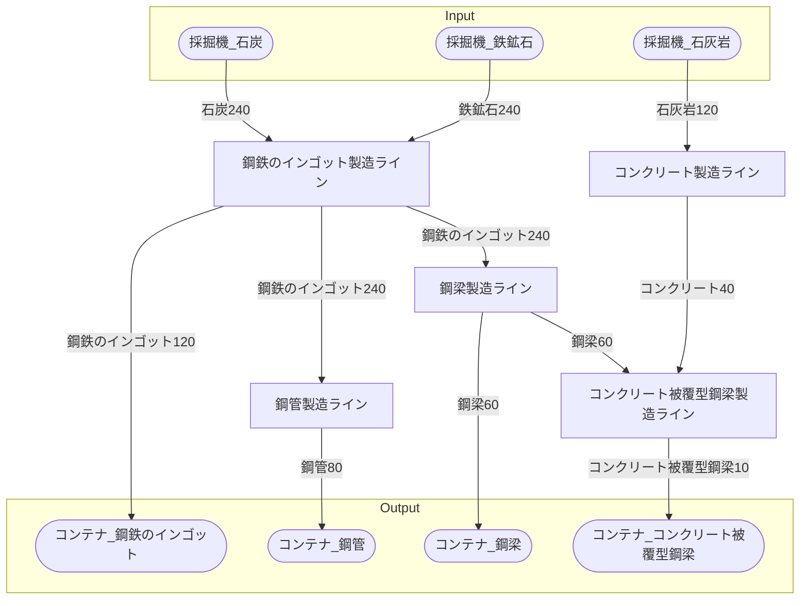

# 鋼鉄工場 全体製造ライン設計書

## 使用レシピ

### 鋼鉄のインゴット
|I/O|物品名|要求数|
|---|---|---|
|input|鉄鉱石|45|
|input|石炭|45|
|---|---|---|
|output|鋼鉄のインゴット|45|
### 鋼管
|I/O|物品名|要求数|
|---|---|---|
|input|鋼鉄のインゴット|30|
|---|---|---|
|output|鋼管|20|
### 鋼梁
|I/O|物品名|要求数|
|---|---|---|
|input|鋼鉄のインゴット|60|
|---|---|---|
|output|鋼梁|15|
### コンクリート
|I/O|物品名|要求数|
|---|---|---|
|input|石灰岩|45|
|---|---|---|
|output|コンクリート|15|
### コンクリート被覆型鋼梁
|I/O|物品名|要求数|
|---|---|---|
|input|鋼梁|18|
|input|コンクリート|36|
|---|---|---|
|output|コンクリート被覆型鋼梁|6|

## 必要製造ライン
### 鋼鉄のインゴット製造ライン

レシピ名 : 鋼鉄のインゴット  
レシピ数 : 3

|I/O|物品名|要求数|
|---|---|---|
|input|鉄鉱石|135|
|input|石炭|135|
|---|---|---|
|output|鋼鉄のインゴット|135|

### 鋼管製造ライン

レシピ名 : 鋼管  
レシピ数 : 4

|I/O|物品名|要求数|
|---|---|---|
|input|鋼鉄のインゴット|120|
|---|---|---|
|output|鋼管|80|

### 鋼梁製造ライン

レシピ名 : 鋼梁  
レシピ数 : 4

|I/O|物品名|要求数|
|---|---|---|
|input|鋼鉄のインゴット|240|
|---|---|---|
|output|鋼梁|60|

### コンクリート製造ライン

レシピ名 : コンクリート  
レシピ数 : 3

|I/O|物品名|要求数|
|---|---|---|
|input|石灰岩|135|
|---|---|---|
|output|コンクリート|45|

### コンクリート被覆型鋼梁製造ライン

レシピ名 : コンクリート被覆型鋼梁  
レシピ数 : 2

|I/O|物品名|要求数|
|---|---|---|
|input|鋼梁|36|
|input|コンクリート|72|
|---|---|---|
|output|コンクリート被覆型鋼梁|12|

## 製造ラインフローチャート

## 情報
書類テンプレートバージョン : 1.7.0
