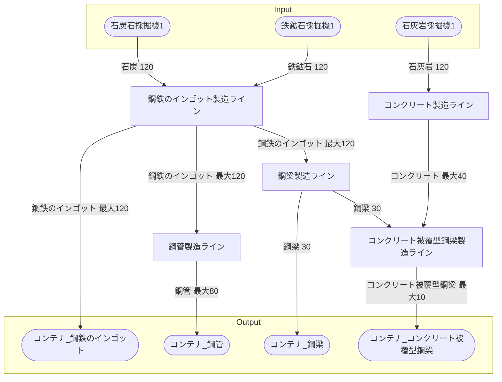

# 鋼鉄工場 全体製造ライン設計書

## 使用レシピ
### 鋼鉄のインゴット
|Input|Output|
|---|---|
|鉄鉱石 45/m|鋼鉄のインゴット 45/m|
|石炭 45/m||
### 鋼管
|Input|Output|
|---|---|
|鋼鉄のインゴット 30/m|鋼管 20/m|
### 鋼梁
|Input|Output|
|---|---|
|鋼鉄のインゴット 60/m|鋼梁 15/m|
### コンクリート
|Input|Output|
|---|---|
|石灰岩 45m|コンクリート 15/m|
### コンクリート被覆型鋼梁
|Input|Output|
|---|---|
|鋼梁 18/m|コンクリート被覆型鋼梁 6/m|
|コンクリート 36/m||

## 必要製造ライン
### 鋼鉄のインゴット製造ライン
|レシピ名|数|Input計|Output計|
|---|---|---|---|
|鋼鉄のインゴット|3|鉄鉱石 135/m|鋼鉄のインゴット 135/m|
|||石炭 135/m||
### 鋼管製造ライン
|レシピ名|数|Input計|Output計|
|---|---|---|---|
|鉄鋼管板|4|鋼鉄のインゴット 120/m|鉄板 80/m|
### 鋼梁製造ライン
|レシピ名|数|Input計|Output計|
|---|---|---|---|
|鋼梁|2|鋼鉄のインゴット 120/m|鋼梁 30/m|
### コンクリート製造ライン
|レシピ名|数|Input計|Output計|
|---|---|---|---|
|コンクリート|3|石灰岩 120/m|コンクリート 40/m|
### コンクリート被覆型鋼梁製造ライン
|レシピ名|数|Input計|Output計|
|---|---|---|---|
|コンクリート被覆型鋼梁|2|コンクリート 120/m|鋼梁 30/m|
|||鋼梁 40/m||

## 製造ラインフローチャート

## 情報
書類テンプレートバージョン : 1.7.0
