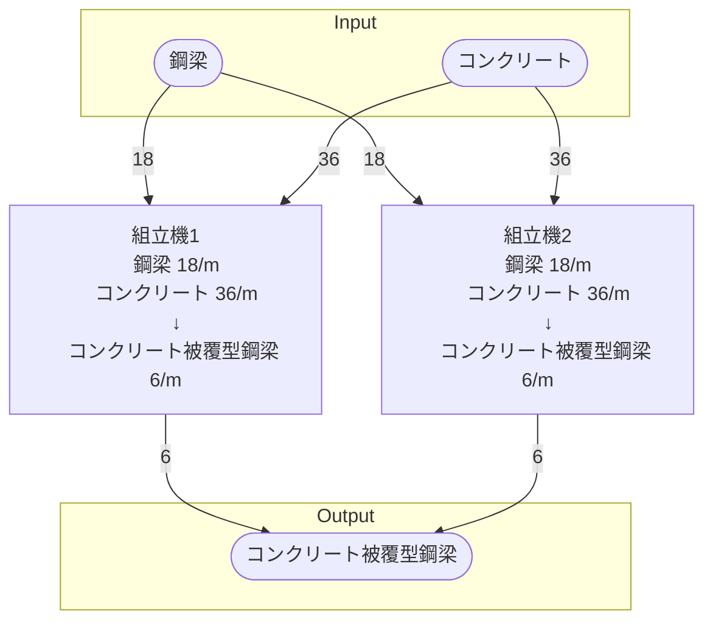

# 個別製造ライン設計書 コンクリート被覆型鋼梁製造ライン

## 概要
以下の物品を生産する

- コンクリート被覆型鋼梁

## Input
- 鋼梁 36/m
- コンクリート 72/m

## Output
- コンクリート被覆型鋼梁 12/m

## 必要設備
- 組立機 2ケ
- ベルトコンベア類 適量

## 製造ライン

## 情報
書類テンプレートバージョン : 1.5.0
