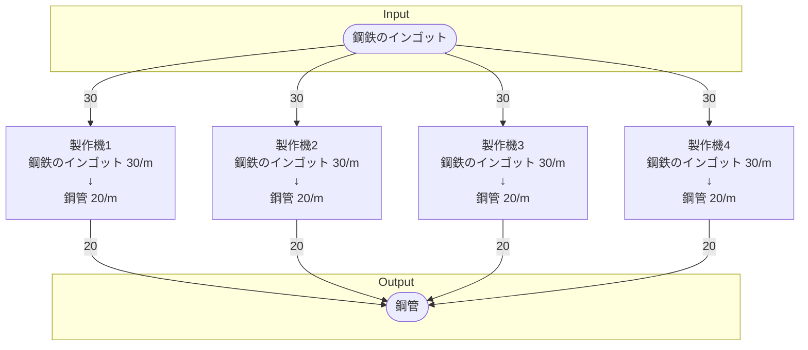

# 個別製造ライン設計書 鋼管製造ライン

## 概要
鋼管を製造するライン

## Input
- 鋼鉄のインゴット 120/m

## Output
- 鋼管 80/m

## 必要設備
- 製作機 4ケ
- ベルトコンベア類 適量

## 製造ライン

```mermaid
flowchart TD

subgraph Input
    鋼鉄のインゴット([鋼鉄のインゴット])
end

製作機1[
    製作機1
    鋼鉄のインゴット 30/m
    ↓
    鋼管 20/m
]

製作機2[
    製作機2
    鋼鉄のインゴット 30/m
    ↓
    鋼管 20/m
]

製作機3[
    製作機3
    鋼鉄のインゴット 30/m
    ↓
    鋼管 20/m
]

製作機4[
    製作機4
    鋼鉄のインゴット 30/m
    ↓
    鋼管 20/m
]

subgraph Output
    鋼管([鋼管])
end

鋼鉄のインゴット-->|30|製作機1
製作機1-->|20|鋼管
鋼鉄のインゴット-->|30|製作機2
製作機2-->|20|鋼管
鋼鉄のインゴット-->|30|製作機3
製作機3-->|20|鋼管
鋼鉄のインゴット-->|30|製作機4
製作機4-->|20|鋼管
```

## 情報
書類テンプレートバージョン : 1.5.0
