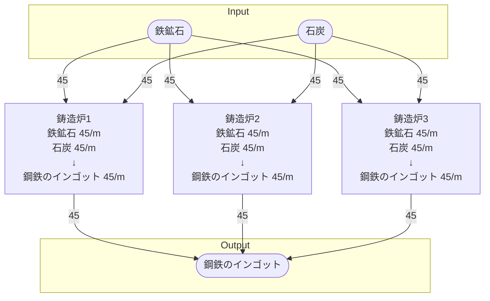

# 個別製造ライン設計書 鋼鉄のインゴット製造ライン

## 概要
以下の物品を生産する

- 鋼鉄のインゴット

## Input
- 鉄鉱石 135/m
- 石炭 135/m

## Output
- 鋼鉄のインゴット 135/m

## 必要設備
- 鋳造炉 3ケ
- ベルトコンベア類 適量

## 製造ライン

```mermaid
flowchart TD

subgraph Input
    鉄鉱石([鉄鉱石])
    石炭([石炭])
end

鋳造炉1[
    鋳造炉1
    鉄鉱石 45/m
    石炭 45/m
    ↓
    鋼鉄のインゴット 45/m
]

鋳造炉2[
    鋳造炉2
    鉄鉱石 45/m
    石炭 45/m
    ↓
    鋼鉄のインゴット 45/m
]

鋳造炉3[
    鋳造炉3
    鉄鉱石 45/m
    石炭 45/m
    ↓
    鋼鉄のインゴット 45/m
]

subgraph Output
    鋼鉄のインゴット([鋼鉄のインゴット])
end

鉄鉱石-->|45|鋳造炉1
石炭-->|45|鋳造炉1
鋳造炉1-->|45|鋼鉄のインゴット
鉄鉱石-->|45|鋳造炉2
石炭-->|45|鋳造炉2
鋳造炉2-->|45|鋼鉄のインゴット
鉄鉱石-->|45|鋳造炉3
石炭-->|45|鋳造炉3
鋳造炉3-->|45|鋼鉄のインゴット
```

## 情報
書類テンプレートバージョン : 1.5.0
